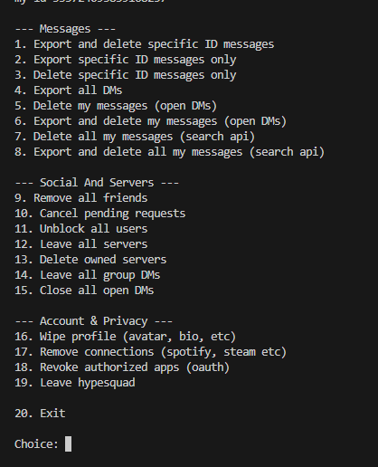
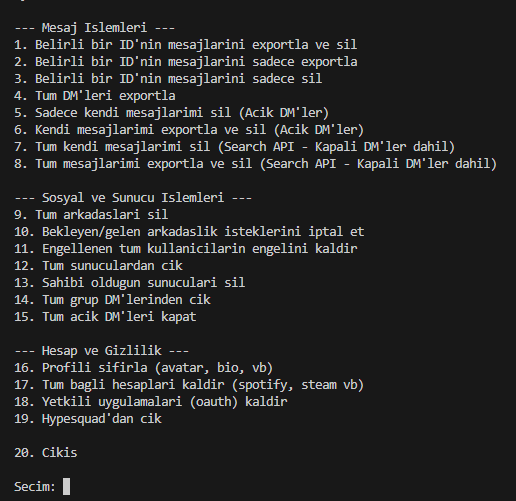

# Discord Cleanup Tool

A script to manage, export, and delete your Discord DMs and manage other account settings.

## Installation

1. Make sure you have Python 3.7+ installed.
2. Install the required dependency:

```bash
pip install aiohttp
```

## Usage

Run the script using Python:

```bash
python main.py
```

On the first run, the script will ask for your **Discord Token** and **User ID**. It will save these to a `config.json` file so you won't have to enter them again. If you need to change the token or ID, simply edit or delete `config.json`.



# Discord Cleanup Tool(TR)

Discord DM'lerinizi yönetmek, dışa aktarmak (export), silmek ve diğer hesap ayarlarınızı yönetmek için geliştirilmiş bir script.

## Kurulum

1. Bilgisayarınızda **Python 3.7** veya daha yeni bir sürümün kurulu olduğundan emin olun.
2. Gerekli bağımlılığı yükleyin:

```bash
pip install aiohttp
```

## Kullanım

Scripti Python ile çalıştırın:

```bash
python main.py
```

İlk çalıştırmada script sizden **Discord Token** ve **User ID** bilgilerinizi isteyecektir. Bu bilgiler, tekrar girmenize gerek kalmaması için `config.json` dosyasına kaydedilir.

Token veya User ID'nizi değiştirmek isterseniz, `config.json` dosyasını düzenleyebilir veya silebilirsiniz.

